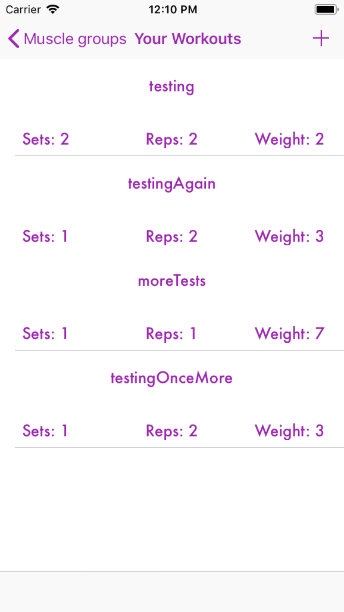

# Gymalytics

Gymalytics is an iOS fitness application I've built with swift, designed around providing workout analytics to users with a simple and intuitive UI.

## Motivation
A lot of gym members often face the problem of keeping track of what workouts they've been doing, with what weights, sets, and other parameters. The current solution to this is often noting it down on a small notebook, commiting it to memory, or writing it down on your phone or a spreadsheet. What's more is that with all of this data being collected (poorly), it's hard to make sense of any progression. This app is designed to allow you to enter your workout parameters on the go, as you workout and in between sets. The data is then processed in order to deliver analytics on your fitness progression in each muscle group that you define per session.

  
   
  

## Technology
This application was built primarily with Swift (though I experimented with other languages such as Objective-C, React Native, and Flutter before choosing Swift), a powerful object oriented programming language. You can learn more about Swift including a brief tutorial here:
https://developer.apple.com/swift/

Additionally, the charts are powered by the iOS charts SDK. You can learn how to use this SDK in your application right here:
https://github.com/danielgindi/Charts

The backend of this application is powered with the use of Firebase. Authentication is enabled via an email login, and data is stored using the Firebase Database, a NoSQL key-value object tree.

## Usage
For personal/developer usage go to firebase and set up firebase for an iOS application. Download and save your GoogleServices-Info.plist file, this will be your own firebase key.

Then just clone this repository and past your database key in the appropriate directory, and run the application!
